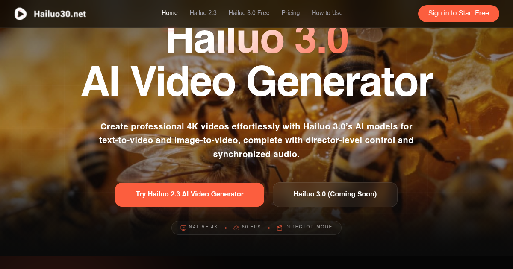

# Hailuo 3.0

> Next-generation AI video generator for text-to-video and image-to-video creation

[**Hailuo 3.0**](https://hailuo30.net/) is a powerful AI video generator that transforms your creative ideas into stunning videos. Whether you want to convert text descriptions into dynamic visuals or animate static images, Hailuo 3.0 delivers professional-quality results with cutting-edge AI technology.

## ✨ Features

- **Text-to-Video** - Transform text prompts into captivating videos with AI
- **Image-to-Video** - Animate static images into dynamic video content
- **Professional Quality** - High-resolution output suitable for any project
- **Fast Generation** - Get your videos in minutes, not hours
- **Easy to Use** - Simple interface, no technical skills required

## 🚀 Quick Start

Visit [https://hailuo30.net/](https://hailuo30.net/) to get started with [Hailuo 3.0](https://hailuo30.net/).

## 🎬 Use Cases

- **Marketing Videos** - Create engaging promotional content
- **Social Media** - Generate eye-catching posts and stories
- **Educational Content** - Bring learning materials to life
- **Creative Projects** - Express your artistic vision

## 📝 License

MIT License - See [LICENSE](LICENSE) for details.
